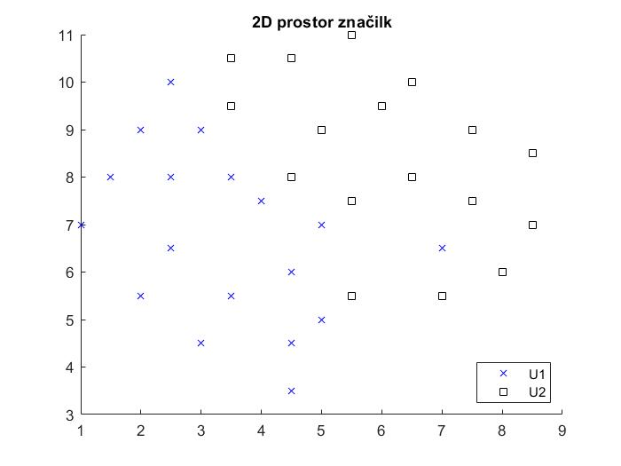
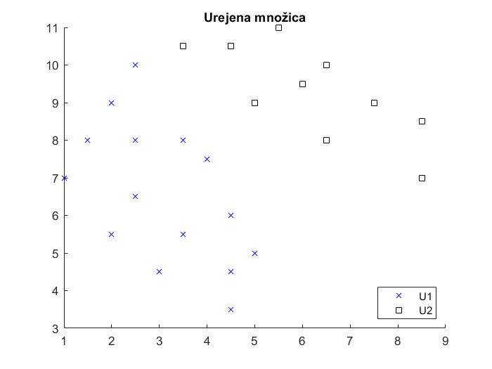
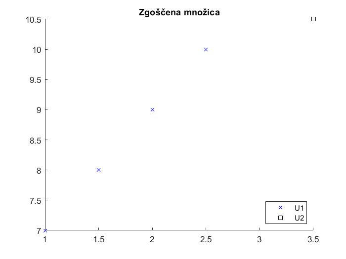

# Razvrscanje-vzorcev-z-urejeno-in-zgosceno-ucno-mnozico
Program, ki udejanji razvrščanje vzorcev s prileganjem s pravilom najbližjega soseda, 1-NN,
glede na podano učno množico vzorcev, oziroma glede na učno množico, ki je urejena in zgoščena, pri čemer
za osnovno mero različnosti med vzorci uporabimo Evklidovo razdaljo.
> **Rezultat programa:**

